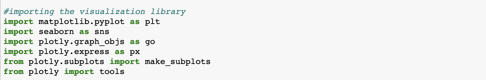
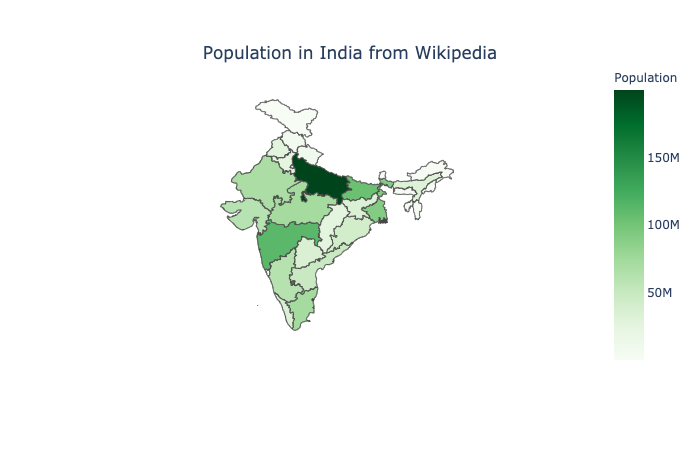

# Power Generation in India - Exploratory Data Analysis (EDA)
### This notebook is using plotly which will not show the plotly chart in Github so I recommend you to use [NB viewer](http://nbviewer.jupyter.org/)
- Connecting the population in India into the actual and estimated power generation
- Understanding the connection between how much power is generated with the total population
- Understanding the plan of India government to keep and even increase the energy generation in India

# Quickstart
This command is used to install plotly before you run the plotly function
`pip install plotly==4.9.0`

Here is the module that I used

# Data Exploration
The spread of population in India

The spread of power generation in each region in India

The overall actual energy generation

Per-Capita Energy Consumption VS Energy Generation

